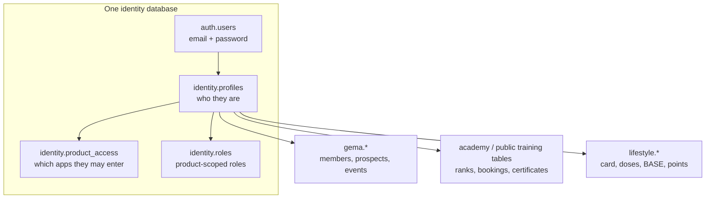

# Unified GutGuard Profile

**Status:** design, not implemented. Do not apply the companion SQL to production.

**Companion SQL:** `supabase/identity_schema.sql` (proposal only).

**Sister docs:** [gentrep-academy](https://github.com/atc1989/gentrep-academy/blob/main/docs/unified-profile.md) · [gutguard-life-style](https://github.com/atc1989/gutguard-life-style/blob/main/docs/unified-profile.md)

One person. One login. One profile row. Three products.

Today GEMA, Gentrep Academy, and GutGuard Lifestyle each mint their own account. The same human can exist three times, with three passwords, three `profiles` rows, and three different ideas of “who I am.” This note expands that problem into a shared identity model, a target schema, a migration sequence, and the owner decisions that have to land before any production cutover.

---

## 1. Goal

A GutGuard person signs up or is invited once. That identity is then usable in:

| Product | What the person is here | What this product owns |
| --- | --- | --- |
| **GEMA** | prospect, member, host, or admin | events, referrals, genealogy, commissions, QR passes |
| **Gentrep Academy** | member, staff, trainer, clinician, support, or admin | ranks, bookings, certificates, admin portal |
| **GutGuard Lifestyle** | invited / claimed / member patient | door card, dose logs, BASE, points, stories |

Shared across all three: name, email, mobile, avatar, locale, timezone, account status, last seen.

Not shared: GEMA rank, Academy rank, Lifestyle points, door-card number, sponsor tree, certificates, dose calendar.

Signing in to Lifestyle must not create an Academy BASE rank. Completing Academy must not make someone a GEMA distributor. Product access is explicit.

---

## 2. Current state (as of 2026-08-27)

### 2.1 Three apps, three account contracts

| | GEMA | Gentrep Academy | GutGuard Lifestyle |
| --- | --- | --- | --- |
| Auth | Email + password, with OneGrinders Guild as the primary verifier and a local password backup | Email + password. Global self-signup disabled. Invite / admin provision | README says email OTP; code is email + password. Falls back to `localStorage` mock when Supabase env is empty |
| Profile table | `gema.profiles` (live). Repo `schema.sql` still describes `public.profiles` | `public.profiles` | `public.profiles` |
| Client schema | All Supabase clients pin `db: { schema: "gema" }` | Default `public` | Default `public` |
| New-user trigger | `public.handle_new_user` inserts `gema`/`public` profile identity fields | `academy.handle_new_user` inserts a profile **and** a `member` role **and** BASE rank progress | App upserts Lifestyle columns on register; no shared trigger |
| Roles | Single enum on the profile: `prospect \| member \| host \| admin` plus `is_admin` | `user_roles` rows: `member, trainer, staff, admin, clinician, support` | Optional `role` text on Staging `public.profiles`; members can update their own row |
| Phone | Optional `gema.profiles.phone`. **0 of 431** production auth users have `auth.users.phone` | Not on the profile | Required unique `mobile` |

Those `app_role` enums cannot be merged. GEMA `member` means distributor. Academy `member` means trainee. Lifestyle has no equivalent enum.

### 2.2 Two live Supabase projects, overlapping leftovers

Observed in the GutGuard org (`runutujuusoeukxhjhzy`):

**`rvwseybgimmewuoccecu` — named “GutGuard Life Style”, used as GEMA production**

- 431 `auth.users`, all email provider, 428 confirmed, 0 phone numbers
- 431 `gema.profiles`: 296 prospect, 134 member, 1 admin
- 136 `gema.members`
- Leftover GutGuard Daily tables (`gema.gutguard_profiles`, dosing, teams, reminders)
- `doctors.*` marketing/shop tables (a fourth product already on this database)
- No Lifestyle `public.profiles`

**`fxdsnacuonfvutdquogb` — named “GutGuard Staging”**

- 6 `auth.users`, 0 rows in `public.profiles` and `gema.profiles`
- Already mixed: `gema.*` (GEMA) **and** `public.profiles` / `dose_logs` / `base_progress` (Lifestyle)
- Also has `doctors.*`

Academy’s documented staging project `qipwvvhmhxqzlmezvjxu` is **not** in this org snapshot. Academy currently has its own Auth island.

So the three systems do not merely have different *tables*. They have different *Auth user sets*. A person who is a GEMA member cannot open Academy or Lifestyle with that same `auth.users.id`.

### 2.3 Why “one profile table” is not enough

GEMA’s own data architecture already said the right split and then stopped at the GEMA boundary:

> `profiles`: one row per Auth user; shared identity for prospects, members, hosts, and admins.
> `members`: authenticated business/member account with rank, sponsor, member code.

Academy then put training state on `profiles` (`member_card`, `current_rank_id`, `team_id`). Lifestyle put product state on `profiles` (`points`, `phase`, `claimed`, `card_no`, `capsules_per_day`). GutGuard Daily added a third profile (`gema.gutguard_profiles`). Staging put Lifestyle columns onto `public.profiles` in the same project that already has `gema.profiles`.

If we naively “merge profiles,” we get one wide row that every app can corrupt, and we still have three Auth databases.

---

## 3. Target model

Four layers. Each layer has one job.

### Layer 1 — Credentials (`auth.users`)

Supabase Auth is the only login source. One row per person.

- Canonical method for v1: **email + password** (what GEMA production and Academy already use).
- Lifestyle’s mock session is a UI-only fallback and must not survive the cutover.
- Phone OTP and SMS are a later Auth setting on this same project, not a second user table.
- OneGrinders stays a **GEMA provisioning path**: verify with the guild, then create or link `auth.users` + `identity.profiles`. It must not remain a second source of truth for name/email.

### Layer 2 — Person (`identity.profiles`)

Who they are. Nothing about what they can do in a product.

| Column | Type | Rules |
| --- | --- | --- |
| `id` | uuid PK | `= auth.users.id`, `on delete cascade` |
| `email` | citext | unique; copied from Auth on insert/update |
| `full_name` | text not null | display name |
| `first_name` / `last_name` | text | optional; GEMA already stores these |
| `phone` | text | unique when present; store E.164 (`+63…`) and accept `09…` at the app edge |
| `avatar_url` | text | optional |
| `locale` | text | default `en` |
| `timezone` | text | default `Asia/Manila` |
| `account_status` | enum | `invited \| active \| suspended \| closed` — global kill switch |
| `last_seen_at` | timestamptz | updated by any product |
| `created_at` / `updated_at` | timestamptz | |

RLS: the person can read/update their own identity fields except `account_status`. Status changes go through a security-definer RPC (admin / support), never a self-update.

This table is **not** `public.profiles`. That name is already Lifestyle on Staging and Academy in the Academy project. A new `identity` schema avoids a destructive rename on day one.

### Layer 3 — Entitlement (`identity.product_access`)

Which apps this person may enter.

| Column | Type | Rules |
| --- | --- | --- |
| `profile_id` | uuid | FK → `identity.profiles` |
| `product` | text | `gema \| academy \| lifestyle` |
| `status` | text | `invited \| active \| suspended \| closed` |
| `granted_at` / `granted_by` | timestamptz / uuid | |
| `metadata` | jsonb | source: `self_signup`, `invite`, `admin`, `onegrinders`, `prospect_convert` |

Primary key: `(profile_id, product)`.

App middleware checks **this table**, not “does a profile exist.” A GEMA prospect who has never been granted Academy access gets the Academy login screen and a calm “no Academy seat yet,” not a half-created BASE rank.

### Layer 4 — Product-scoped roles (`identity.roles`)

| Column | Type | Rules |
| --- | --- | --- |
| `profile_id` | uuid | FK → `identity.profiles` |
| `product` | text | same codes as product_access |
| `role` | text | product vocabulary, not a global enum |
| `created_at` | timestamptz | |
| PK | | `(profile_id, product, role)` |

Examples:

- GEMA: `prospect`, `member`, `host`, `admin`
- Academy: `member`, `trainer`, `staff`, `admin`, `clinician`, `support`
- Lifestyle: `member` (patient). Admin for Lifestyle stays on Academy’s portal roles until a Lifestyle-native admin exists.

Authorization data lives here (and/or Auth `app_metadata` written by service role). It must **not** live in `raw_user_meta_data` and must **not** sit on a self-updatable profile column. Lifestyle’s Epic 5 already recorded that rule.

### Layer 5 — Product records (unchanged job, new FK)

Each product keeps its own tables, keyed by `profile_id`.

| Product | Keep | Move off identity |
| --- | --- | --- |
| GEMA | `gema.members`, `gema.prospects`, events, referrals, genealogy, commissions | `role`, `is_admin`, `can_publish_events` leave `gema.profiles` and become `identity.roles` + GEMA-specific flags on `gema.members` |
| Academy | ranks, bookings, certificates, `user_roles` (until swapped), clinician assignments | `member_card`, `current_rank_id`, `team_id`, `is_demo` leave `public.profiles` |
| Lifestyle | new `lifestyle.members` (or keep a dedicated table) for `card_no`, `phase`, `claimed`, points, capsules, sponsor/team labels | those columns leave `public.profiles` |

`gema.members.profile_id` already matches this shape. Academy and Lifestyle need the same split GEMA already has: **person ≠ product membership**.

---

## 4. Field map (today → target)

### Identity fields (converge)

| Meaning | GEMA live `gema.profiles` | Academy `public.profiles` | Lifestyle `public.profiles` | Target |
| --- | --- | --- | --- | --- |
| Auth id | `id` | `id` | `id` | `identity.profiles.id` |
| Email | `email` | `email` (added in admin portal) | `email` | `identity.profiles.email` |
| Display name | `full_name` | `full_name` | `name` | `identity.profiles.full_name` |
| Given / family | `first_name`, `last_name` | — | — | keep |
| Phone | `phone` | — | `mobile` (required, unique) | `identity.profiles.phone` |
| Avatar | `avatar_url` | — | — | `identity.profiles.avatar_url` |
| Locale / TZ | leftover Daily `gutguard_profiles.locale/timezone` | `locale` | — | `identity.profiles.locale/timezone` |
| Last seen | `last_seen_at` | `last_seen_at` | — | `identity.profiles.last_seen_at` |
| Global status | — | `account_status`, `support_hold` | — | `identity.profiles.account_status` |

### Product fields (stay in product schemas)

| Meaning | Today | Target |
| --- | --- | --- |
| GEMA distributor rank / sponsor / member code / username | `gema.members` | unchanged |
| GEMA `role` / `is_admin` / `can_publish_events` | on `gema.profiles` | `identity.roles` + `gema.members.can_publish_events` |
| Academy card / current rank / team / demo | on `public.profiles` | Academy member record |
| Lifestyle card / phase / claimed / points / capsules / sponsor / team | on `public.profiles` | `lifestyle.members` |
| GutGuard Daily patient role | `gema.gutguard_profiles` | do not revive; Daily was dropped from the GEMA app |

---

## 5. Auth and session behavior

### 5.1 One account, then true SSO

v1 is **one account, same credentials**, not yet one shared browser session.

Each Vercel project has its own cookies. Pointing all three apps at the same Supabase project means:

- The same email/password works in GEMA, Academy, and Lifestyle.
- The person still signs in on each origin unless we later add a shared parent domain or an Auth redirect handshake.

v2 (after v1 is stable): allow-list all three production + preview origins on the Auth project, then add a sign-in redirect so a session on `*.gutguard…` can continue into the next app. Do not invent a custom JWT.

### 5.2 Signup rules (this is the dangerous part)

Today, Academy’s `academy.handle_new_user` fires on **every** `auth.users` insert. If Academy and GEMA share a project and that trigger stays, a Lifestyle or GEMA signup would also get an Academy `member` role and BASE rank. That is the bug this design exists to prevent.

Replacement trigger, one only:

1. Insert `identity.profiles` from Auth email + metadata.
2. Stop.
3. The product that performed signup then writes `identity.product_access` for **itself** and creates its own membership row.

| Entry path | Identity row | Product access granted | Other products |
| --- | --- | --- | --- |
| GEMA prospect registers for an event (no account) | none yet | none | none |
| GEMA prospect converts / member onboards / OneGrinders provision | created | `gema` | none |
| Academy invite / admin provision | created | `academy` | none |
| Lifestyle register | created | `lifestyle` | none |
| Existing identity later opens a second product | reused | new row for that product | unchanged |

GEMA prospects can remain `gema.prospects` without an `auth.users` row, as they do today. They join identity only when they actually create a login.

### 5.3 Cross-product gates

- Lifestyle GEMA lock stays `lifestyle_base_complete()` — that is BASE **activation**, not Academy rank, not GEMA membership.
- Academy access is not implied by a GEMA `members` row unless the owner later says “active distributor ⇒ Academy seat.” Until that decision, grant Academy access separately (invite or admin).
- A global `account_status = suspended \| closed` blocks every product. A per-product `product_access.status = suspended` blocks only that app.

---

## 6. Row Level Security

- Enable RLS on every `identity` table.
- `identity.profiles`: select/update own row; admin/support select via security-definer helpers, not a world-readable policy.
- `identity.product_access` / `identity.roles`: the member can **read** their own rows. Inserts and role grants are service-role / security-definer only. Never trust `user_metadata`.
- Product tables keep their current RLS, but replace “is admin” checks that read a self-updatable column with `identity.roles`.
- Views that join identity to product data use `security_invoker = true`.
- GEMA clients that pin `schema: "gema"` need a second client (or `schema: "identity"` option) to read the shared profile. Do not duplicate identity columns back into `gema.profiles` “for convenience.”

---

## 7. Home database

Recommendation: **keep production identity on `rvwseybgimmewuoccecu`** (the 431-user GEMA project), even though the dashboard name says “GutGuard Life Style.” That is already the only populated Auth set.

Staging identity: **`fxdsnacuonfvutdquogb` (GutGuard Staging)**. It already contains both `gema.*` and Lifestyle `public.*`. Academy staging should be pointed here (or rebuilt here) instead of a third Auth island.

Rename the production project in the Supabase dashboard to **GutGuard Identity** (or GutGuard Production) so the next agent does not treat it as Lifestyle-only.

The `doctors` schema already lives on both projects. This spec does not pull Doctors into `identity.product_access` unless the owner says so. Do not let Doctors marketing tables block the member-identity work, and do not silently grant Doctors access to member PII.

---

## 8. Migration sequence

Do not skip phases. Do not run identity DDL on production until Staging has hosted a dual-write week.

### Phase 0 — Decisions (this document)

Owner answers in section 10. No schema change on the 431-user project.

### Phase 1 — Schema on Staging only

1. Apply `supabase/identity_schema.sql` to GutGuard Staging.
2. Expose the `identity` schema in the Data API.
3. Dual-write: keep `gema.profiles` / Academy `public.profiles` / Lifestyle `public.profiles` as the apps’ current read path.
4. Replace Academy’s `handle_new_user` with the identity-only trigger **on Staging**. Prove a GEMA signup does not create Academy rank rows.

### Phase 2 — Backfill and link

Match people by `lower(email)`.

| Case | Action |
| --- | --- |
| Email exists in exactly one Auth project | Create `identity.profiles` from that user; grant the product they came from |
| Same email in two Auth projects | Do not auto-merge. Queue for an admin link tool. Passwords will differ |
| Phone match, email differs | Do not auto-merge. Queue |
| GEMA prospect with email but no `auth.users` | Leave as prospect; create identity only at conversion |
| Synthetic Academy `gentrep.test` / demo users | Never backfill into production identity |

Preserve `auth.users.id` from the **home** project (production GEMA ids). Foreign keys in `gema.members` already use those ids. Academy/Lifestyle ids from other projects are mapped, not kept, unless that person has no GEMA row.

### Phase 3 — Apps read identity

1. GEMA: add an identity-schema client; settings/admin people screens read `identity.profiles`; `gema.profiles` becomes a compatibility view.
2. Academy: stop storing `email` / `full_name` / `locale` / `last_seen_at` / `account_status` on `public.profiles`; join identity.
3. Lifestyle: stop using mock sessions against real Auth; persist `lifestyle.members` for card/points/phase; read name/mobile from identity.
4. All three Vercel projects get the **same** `NEXT_PUBLIC_SUPABASE_URL` on Staging, then Production.

### Phase 4 — Cut over Auth

1. Enable email+password on the home project (already true for GEMA).
2. Allow-list Academy and Lifestyle Site URLs + redirects.
3. Invite or password-reset Academy/Lifestyle-only people onto the home project.
4. Disable sign-in on the abandoned Auth projects after a freeze window.
5. Drop compatibility views only after each app has shipped a release that no longer queries the old profile table.

### Phase 5 — True SSO (optional)

Shared parent domain or Auth redirect handshake. Separate ticket.

---

## 9. What each repo owes

Work stays in product repos. Do not edit the Tech Stack or Design System vaults.

| Repo | Work |
| --- | --- |
| **gema** (this repo) | Canonical spec + proposed SQL. Later: identity client, stop treating `gema.profiles.role` as global admin, OneGrinders writes identity + `product_access=gema` only |
| **gentrep-academy** | Split training fields off `public.profiles`. Identity-only new-user trigger. Portal directory reads identity. Do not auto-enrol GEMA/Lifestyle signups as Academy members |
| **gutguard-life-style** | `lifestyle.members` for card/points/phase. Register grants Lifestyle access only. Kill mock session once env points at shared Auth. Keep Epic 5 rule: members cannot write their own admin role |

---

## 10. Owner decisions (block production)

Answer these before Phase 1 touches production. Staging may proceed on the defaults.

| # | Question | Default if unanswered | Why it matters |
| --- | --- | --- | --- |
| D1 | Is `rvwseybgimmewuoccecu` the permanent identity home? | Yes; rename the project in the dashboard | 431 users and all `gema.members` FKs live here |
| D2 | Does an active GEMA member automatically get Academy and/or Lifestyle access? | No. Grant per product | Prevents surprise BASE ranks and door cards |
| D3 | How are Academy accounts created after unification: invite only, or any identity may request a seat? | Invite / admin, same as today | Academy currently disables self-signup |
| D4 | Lifestyle self-register: create a new identity, or require an existing GEMA/Academy person? | Create identity + Lifestyle access only | Funnel should not demand a distributor login |
| D5 | Same email, two passwords, two Auth projects — merge how? | Admin tool; person picks the surviving password (reset email) | Auto-merge will lock people out |
| D6 | Is OneGrinders still required for GEMA after unification? | Yes for existing members; new members can be local-only | External API remains a GEMA adapter, not the identity spine |
| D7 | Does Doctors join this identity? | Not in this pass | Doctors already shares the Postgres instance |
| D8 | Canonical phone format and uniqueness | E.164 `+63…`; unique when present | Lifestyle already rejects duplicate mobiles |
| D9 | v1 session model | Same password, separate cookies | True SSO is Phase 5 |
| D10 | Global suspend vs per-product suspend | Both: `identity.profiles.account_status` and `product_access.status` | Support holds today live on Academy profiles |

---

## 11. Out of scope

- Merging GEMA commissions with Lifestyle points
- Merging GEMA ranks with Academy ranks (different catalogs)
- Shared UI chrome / design-system work
- Moving Doctors registrations onto `identity.profiles`
- Applying this SQL to production in this change
- Building the admin merge UI (Phase 2)

---

## 12. Definition of done (later implementation)

A person with one email can:

1. Sign in to GEMA, Academy, and Lifestyle with the same password once each product has granted access.
2. Change display name or mobile once and see it in all three (after each app is cut over).
3. Be suspended globally and lose all three, or be suspended in Academy only and still open Lifestyle.
4. Register for Lifestyle without becoming an Academy trainee or a GEMA distributor.

Until those four are true against Staging with fictional users, production Auth stays as it is.
